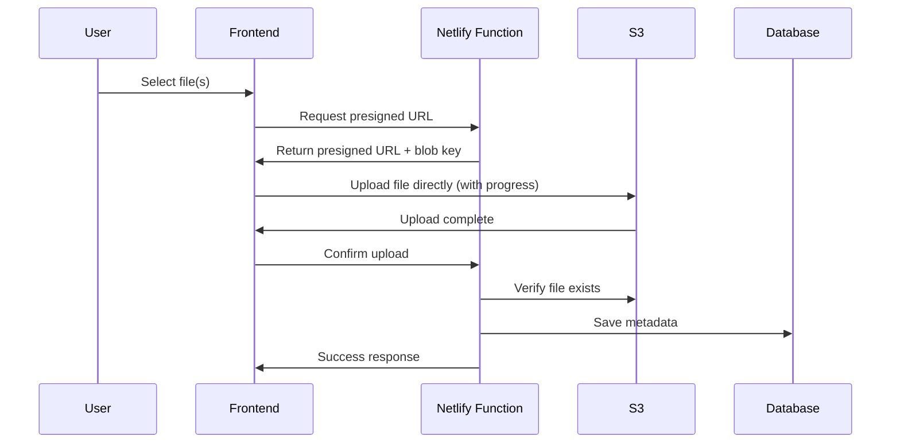

# Large File Upload Implementation

## Overview
This document describes the implementation of direct S3 upload functionality that bypasses Netlify Function limitations to support large file uploads (up to 100MB and beyond).

## Problem
Netlify Functions have a 6MB request payload limit (effectively 4.5MB for binary data after Base64 encoding), which prevented uploading files larger than this limit through the original implementation.

## Solution: Direct S3 Upload with Presigned URLs

### Architecture
The implementation uses a three-step process:

1. **Request Presigned URL**: Client requests a presigned upload URL from Netlify Function
2. **Direct S3 Upload**: Client uploads file directly to S3 using the presigned URL
3. **Confirm Upload**: Client confirms successful upload to save metadata in database

### Benefits
- **No size limitations** from Netlify Functions (only S3 limits apply)
- **Faster uploads** (direct to S3, no proxy through Netlify)
- **Progress tracking** for better user experience
- **Lower server costs** (reduced bandwidth through Netlify)
- **Automatic retry** on failure
- **Simplified architecture** (no proxy fallback complexity)

## Implementation Details

### Backend Components

#### 1. `admin-get-upload-url.js`
- Validates admin authorization
- Checks file size against configured limit (100MB default)
- Generates unique blob key for S3
- Returns presigned upload URL valid for 1 hour

#### 2. `admin-confirm-upload.js`
- Validates admin authorization
- Verifies file exists in S3
- Saves file metadata to database
- Assigns file to users/admins as configured

#### 3. `s3-storage.js`
- Added `getSignedUploadUrl()` method for generating presigned upload URLs
- Uses AWS SDK v3 for S3 operations

### Frontend Components

#### `AdminPanel.jsx`
- Modified upload flow to use presigned URLs
- Added XMLHttpRequest for progress tracking
- Implemented retry logic on failure
- Visual progress bars with status indicators

### Upload Flow

## Features

### Progress Tracking
- Real-time upload progress percentage
- Visual progress bar
- Status indicators:
  - Preparing (getting URL)
  - Uploading (with percentage)
  - Uploaded (success)
  - Failed (with error)
  - Retrying (on retry attempt)

### Error Handling
- Automatic retry option on failure
- Detailed error messages
- Graceful degradation for network issues

### File Size Limits
- Configurable limit (default 100MB)
- Checked both client and server side
- Clear error messages for oversized files

## Configuration

### Environment Variables
No new environment variables required. Uses existing S3 configuration:
- `S3_ENDPOINT`
- `S3_ACCESS_KEY_ID`
- `S3_SECRET_ACCESS_KEY`
- `S3_BUCKET`
- `S3_REGION`

### Adjusting File Size Limit
To change the maximum file size, modify the `MAX_FILE_SIZE` constant in:
- `netlify/functions/admin-get-upload-url.js`
- `netlify/functions/admin-upload-file.js` (for backward compatibility)

## Security Considerations

1. **Authentication**: All endpoints require valid JWT token with admin privileges
2. **URL Expiration**: Presigned URLs expire after 1 hour
3. **File Validation**: Server verifies file existence before saving metadata
4. **Unique Keys**: Generated blob keys include timestamp and random string

## Browser Compatibility

The implementation uses standard browser APIs:
- `XMLHttpRequest` for progress tracking (all modern browsers)
- `FormData` for file handling
- `fetch` for API calls

## Migration Notes

The old upload endpoint (`admin-upload-file.js`) remains functional for backward compatibility but is limited to files under 6MB. New uploads automatically use the presigned URL approach.

## Testing

To test large file uploads:

1. Log in as an admin user
2. Navigate to Admin Panel > Files tab
3. Select a file larger than 6MB (up to 100MB)
4. Observe progress bar during upload
5. Verify file appears in file list after upload

## Troubleshooting

### Common Issues

1. **CORS Errors**: Ensure S3 bucket has proper CORS configuration
2. **Upload Fails**: Check S3 credentials and bucket permissions
3. **Progress Not Showing**: Verify browser supports XMLHttpRequest progress events
4. **File Not Found After Upload**: Check S3 bucket region and endpoint configuration

### Debug Mode

Enable console logging to see detailed upload steps:
- Open browser developer console
- Upload a file
- Check console for step-by-step progress

## Performance

- Small files (< 1MB): ~1-2 seconds
- Medium files (1-10MB): ~5-10 seconds
- Large files (10-50MB): ~20-60 seconds (depends on connection speed)

Upload speed primarily depends on user's internet connection to S3, not server processing.
